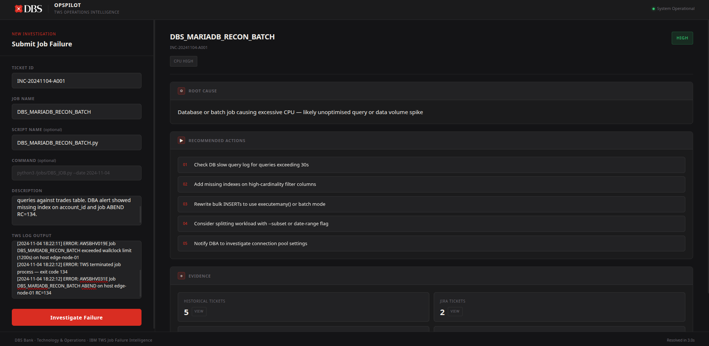

# OpsPilot

OpsPilot is a local demo for investigating IBM TWS job failures. It serves a FastAPI backend and a static UI at the same address.



## Local Mode

The default `config.yaml` is set to local mode:

```yaml
run_mode: "local"
embedding:
  provider: "local"
```

In this mode the app uses:

- `ichamp_tickets_dummy.xlsx` for historical incident data
- `data/dummy_jira_tickets.json` for Jira-style intelligence
- `edge_node_service/dummy_scripts/` and `edge_node_service/dummy_logs/` for edge-node context
- local sentence-transformer embeddings for vector search

## Setup

```bash
python -m venv .venv
./.venv/bin/pip install -r requirements.txt
```

## Create The Vector DB

Build the ChromaDB collection from the bundled dummy iChamp dataset:

```bash
./.venv/bin/python scripts/create_vector_db.py --recreate
```

This creates `ichamp_tickets_dummy.xlsx` with 32 dummy incidents and persists the vector store under `chroma_data/`.

After starting the API, verify the vector DB:

```bash
curl http://localhost:8000/vector-db/count
```

## Run The App

Start the optional edge-node helper in one terminal:

```bash
./.venv/bin/python edge_node_service/edge_agent.py
```

Start the OpsPilot UI/API in another terminal:

```bash
./.venv/bin/python -m app.main
```

Open the UI:

```text
http://localhost:8000/
```

Quick health checks:

```bash
curl http://localhost:8000/health
curl http://localhost:8000/vector-db/count
```

The UI is served from `static/index.html` by the FastAPI app, so there is no separate frontend build step.

## Dummy Investigation Values

Use this scenario in the UI to hit matching dummy iChamp, Jira, script, and log data:

```text
Ticket ID:
INC-20241104-A001

Job Name:
DBS_MARIADB_RECON_BATCH

Script Name:
DBS_MARIADB_RECON_BATCH.py

Command:
python3 /jobs/DBS_MARIADB_RECON_BATCH.py --date 2024-11-04 --mode full

Description:
MariaDB batch reconciliation job CPU spike 96%. Job exceeded wallclock limit after slow queries against trades table. DBA alert showed missing index on account_id and job ABEND RC=134.

TWS Log:
[2024-11-04 18:15:22] ERROR: CPU usage on mariadb-prod-01 reported at 96% — DBA alert triggered
[2024-11-04 18:17:44] WARN: Query elapsed > 120s for account_id=ACC-0078123 (elapsed=133s) — possible full table scan
[2024-11-04 18:20:01] ERROR: DBA alert: slow query log shows SELECT * FROM trades WHERE account_id=? — NO INDEX on account_id
[2024-11-04 18:22:11] ERROR: AWSBHV019E Job DBS_MARIADB_RECON_BATCH exceeded wallclock limit (1200s) on host edge-node-01
[2024-11-04 18:22:12] ERROR: TWS terminated job process — exit code 134
[2024-11-04 18:22:12] ERROR: AWSBHV031E Job DBS_MARIADB_RECON_BATCH ABEND on host edge-node-01 RC=134
```

## API Smoke Test

```bash
curl -X POST http://localhost:8000/investigate \
  -H "Content-Type: application/json" \
  -d '{
    "ticket_id": "INC-20241104-A001",
    "job_name": "DBS_MARIADB_RECON_BATCH",
    "script_name": "DBS_MARIADB_RECON_BATCH.py",
    "command": "python3 /jobs/DBS_MARIADB_RECON_BATCH.py --date 2024-11-04 --mode full",
    "description": "MariaDB batch reconciliation job CPU spike 96%. Job exceeded wallclock limit after slow queries against trades table. DBA alert showed missing index on account_id and job ABEND RC=134.",
    "tws_log": "[2024-11-04 18:15:22] ERROR: CPU usage on mariadb-prod-01 reported at 96% — DBA alert triggered\n[2024-11-04 18:20:01] ERROR: DBA alert: slow query log shows SELECT * FROM trades WHERE account_id=? — NO INDEX on account_id\n[2024-11-04 18:22:12] ERROR: AWSBHV031E Job DBS_MARIADB_RECON_BATCH ABEND on host edge-node-01 RC=134"
  }'
```

## Secret Hygiene

Keep real credentials out of this repo. Use local environment files for sensitive values and leave `.env`, token caches, certificates, and generated vector data untracked.
